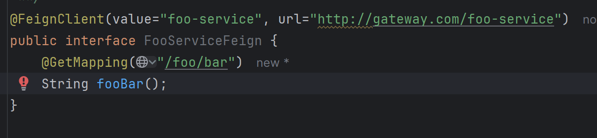
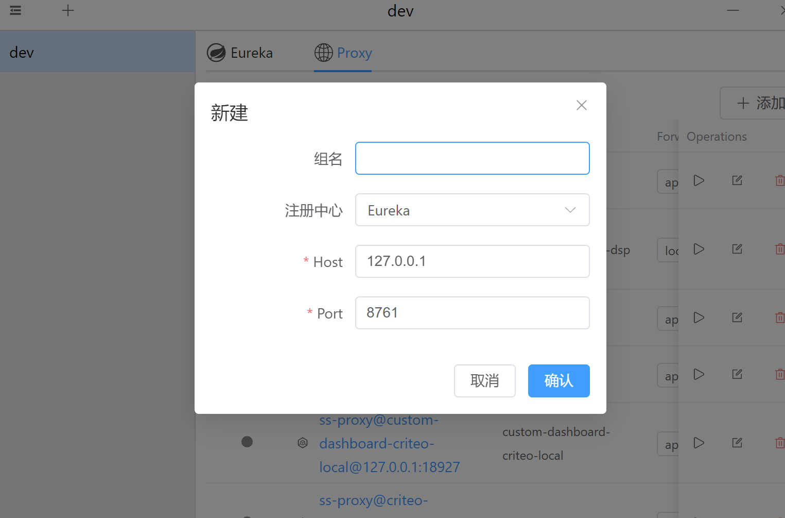
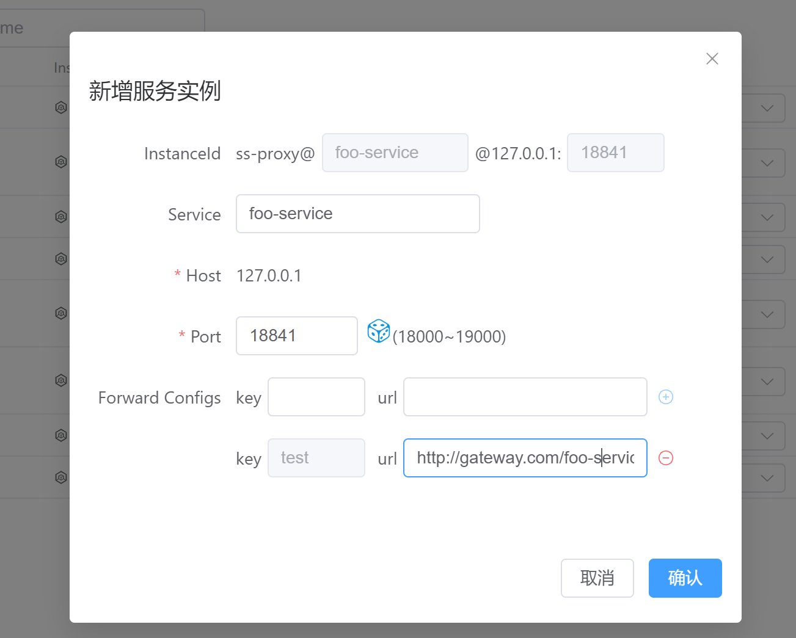
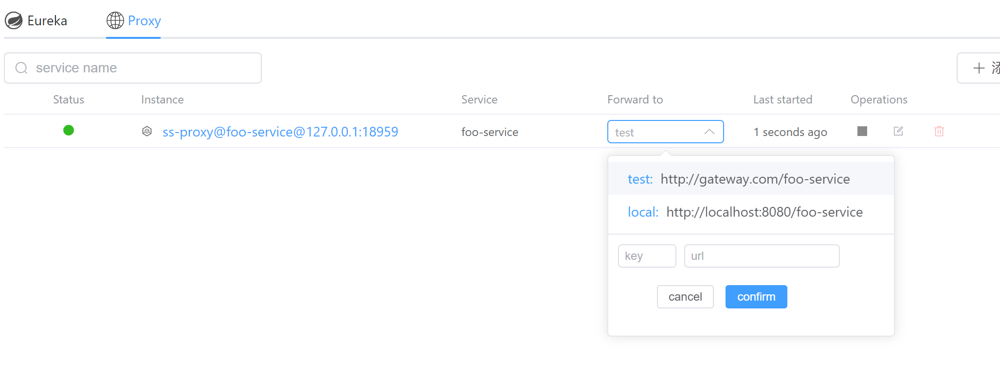
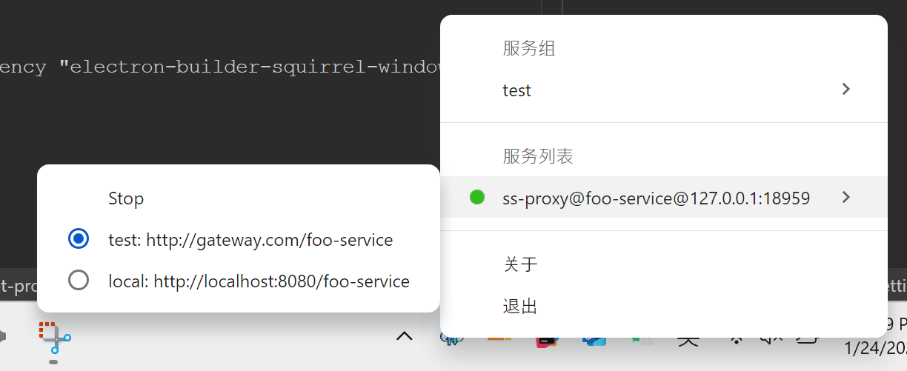

# Switch Service

## Introduction
An app which allows you to start an Eureka proxy service locally in a simple way! A such proxy service is simply an http server which forwards your requests to remote services depending on your configurations.

It targets at the Java developers those're working on SpringCloud projects in the developing phase. 
In SpringCloud, services usually communicates through open-feign, and remote services are declared as interfaces annotated with `@FeignClient`. 
In the test or production environment, remote services are accessed by 'service name' (configured in the `name` or `value` field of `@FeignClient` annotation) for load balancing purposes. But in the local environment, we often have to modify the `url` field, so as to visit directly the remote services running in other environments, e.g., test and uat, since those services are not sharing the same registry with my app. Moreover, before committing the code, we have to remember not to commit the `url` changes,  or just comment it, which is quite annoying sometimes.

A very natural idea came to my mind that, if I start a service locally with the same `service name` I wish to visit, and this service does nothing but proxying my request to the real remote service, then I don't have to modify the `@FeignClient` anymore! 
So I wrote this tool. However it only supports Eureka as registry right now, since this is being used in my company. You can raise an issue if you want other registries to be added.

## Usage
Three steps to start a proxy service: 
1. Create a `service group` with any name you like, and configure the registry.
   
2. Add a `proxy service` in the proxy panel, and configure the targets you wish to forward your requests to.

1. Click the `start` button to make the proxy server up. You can switch the forward configs at runtime.

## Other features
1. Click the `close` button to dock the app to the system tray
2. Right click the `Switch Service` icon in the tray to get menu, with which you can start/stop the server, or switch the proxy config.

## Contact
You can contact me by email (hamarr1024@icloud.com) or raise an issue. 
Any problems or questions are welcome :-)